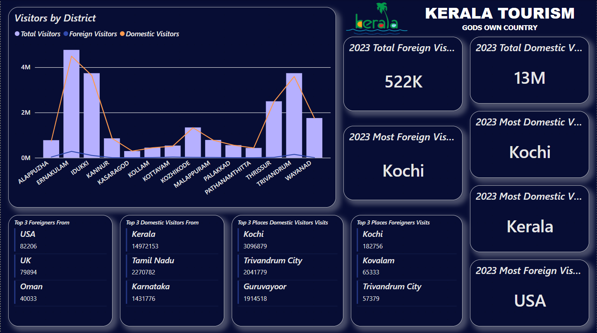
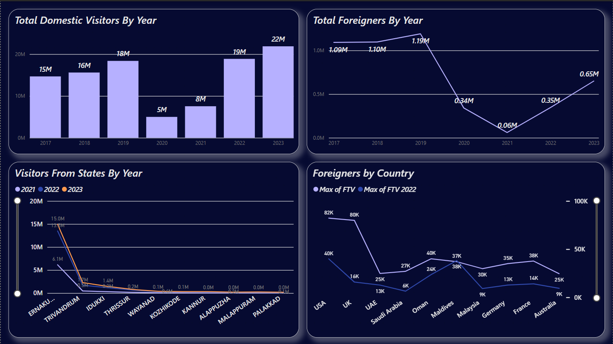
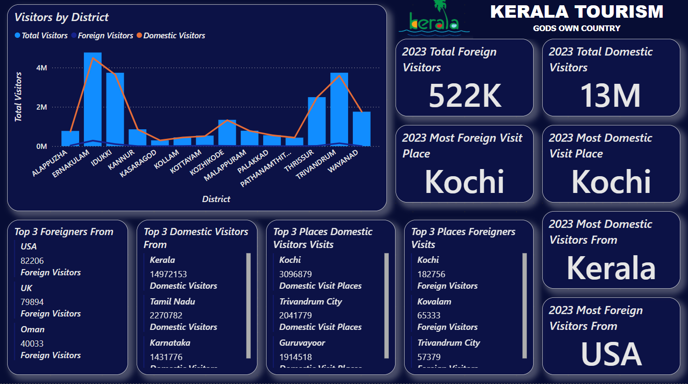
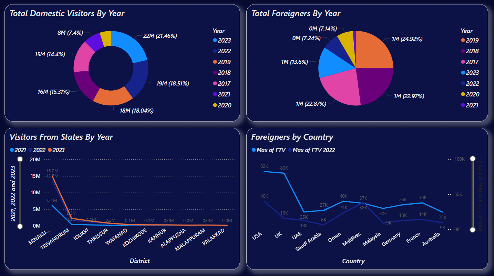

# 🧭 Kerala Tourism Analytics Dashboard – Power BI

## 📌 Project Overview

The **Kerala Tourism Analytics Dashboard** is a comprehensive Power BI project analyzing domestic and international tourism trends across Kerala from **2017 to 2023**. This dashboard enables stakeholders to monitor regional tourism patterns, pre- and post-pandemic impact, and strategic visitor insights.  

It is designed for use by:
- 🏛️ **Tourism departments** to plan infrastructure.
- 📊 **Data analysts** to track seasonal changes.
- 💼 **Vendors** to understand customer demographics.
- 🧭 **Policy makers** to drive tourism recovery strategies.

---

## 📊 Dashboard Structure

### 🟦 Page 1 – **Landing Page Overview**
A high-level visualization showing total visitors by district, origins of tourists, and top places visited.

#### 🔹 Key Highlights
- **Total Visitors in 2023**:
  - 🧳 Foreign Visitors: **522K**
  - 🏡 Domestic Visitors: **13M**
- **Most Visited Place (Foreign & Domestic)**: **Kochi**
- **Top 3 Foreign Visitors Origins**:
  - 🇺🇸 USA – 82,206
  - 🇬🇧 UK – 79,894
  - 🇴🇲 Oman – 40,033
- **Top 3 Domestic Visitors Origins**:
  - Kerala (14.9M)
  - Tamil Nadu (2.27M)
  - Karnataka (1.43M)
- **Top 3 Places Visited by Foreigners**:
  - Kochi
  - Kovalam
  - Trivandrum City
- **Top 3 Domestic Visit Places**:
  - Kochi (3.09M)
  - Trivandrum City (2.04M)
  - Guruvayoor (1.91M)

---

### 📈 Page 2 – **Year-wise Analysis & Trends**
A time series analysis of both foreign and domestic visitor flows (2017–2023).

#### 🕰️ Pre-COVID Tourism (2017–2019)
- Strong and steady growth across both foreign and domestic categories.
- Peak domestic and foreign tourist arrivals observed in **2019**.

#### 🦠 COVID-19 Impact (2020–2021)
- **Drastic fall** in tourism:
  - Travel bans and lockdowns caused a sharp decline in both segments.
  - Foreign visits nearly vanished during 2020–2021.

#### 🔁 Post-COVID Recovery (2022–2023)
- **Domestic tourism surged back** strongly by 2023 (22M+ total).
- Foreign visits resumed gradually but have not fully reached pre-COVID levels.
- **Kerala locals contributed the most** in reviving domestic travel.

---

## 🧠 Narrative Insights (Automated Power BI Summary)

- **Ernakulam** saw the highest visitors in **2021** (6.1M), which was **18,055.91%** higher than Palakkad (33.8K).
- Ernakulam alone contributed **84.02%** of total 2021 visits.
- **Positive correlation** observed between 2021 and 2022 growth patterns.
- Visitor ranges across years:
  - 2021: 33.8K – 6.1M
  - 2022: 127.8K – 13.4M
  - 2023: 165.7K – 14.9M
- **Country with highest deviation** in foreign visits: **UK**, with a gap of **63,992** between FTV and FTV 2022.

---

## 📌 Project Objectives

- 📉 **Analyze tourism trends** before, during, and after COVID-19.
- 📌 **Identify top-performing districts and places** for targeted promotions.
- 📍 **Visualize foreign and domestic origins** of tourists for cultural and logistic planning.
- 📈 **Provide actionable insights** for business and tourism investments.

---

## 🛠️ Tools Used

- **Microsoft Power BI**
- **DAX & Power Query**
- Data Cleaning, Modeling, and Visualization
- Custom narrative generation & storytelling

---

## 📍 Business Impact

✅ **For Government Bodies**  
- Understand which districts need infrastructure upgrades  
- Target marketing for underperforming regions  
- Guide post-COVID recovery initiatives

✅ **For Tourism Vendors**  
- Identify visitor demographics  
- Plan hospitality/transportation services in high-traffic areas  
- Tailor offerings by foreign tourist origin

✅ **For Analysts & Students**  
- Learn real-world time-series analysis  
- Practice storytelling using dashboards  
- Understand pandemic impacts through data

---

## 🚀 Future Scope

- Real-time API integration with tourism department data  
- Exportable reports for stakeholders  
- Expand analysis to hotel occupancy, travel revenue, and seasonal trends  
- Include tourist satisfaction score insights

---

## 🙋 About Me

**👨‍💻 Sanjay S**  
🧑‍🎓 BCA Graduate | Aspiring Data Analyst  
📊 Skills: Power BI, SQL, Excel, Python, Data Modeling, ETL  
🔗 Projects: Demand vs Supply Analysis, Gold Investment, Tata Motors Dashboard  
📍 Location: India

---

## 📌 Dashboard Previews

### Page 1 – Landing Page  

### Page 2 – Yearly Trends  

---

> 🛑 **Disclaimer**: All visualizations are created for educational and analytical purposes. Visitor data belongs to their respective authorities.

